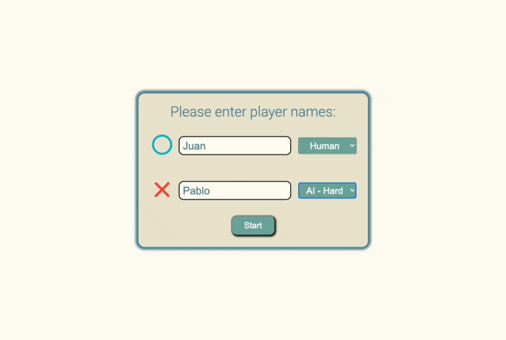

# Unbeatable Tic-tac-toe

Tic-tac-toe game app using vanilla Javascript.

It can be played against another human, or two types of AIs. The first chooses a play at random, while the second uses the Minimax algorithm to be basically unbeatable.

Built as part of [The Odin Project](https://www.theodinproject.com/) curriculum.

By [Héctor González Orozco](https://github.com/hectorgonzalezo)

## :computer: Built With

* [JavaScript](https://www.javascript.com/)
* [Webpack](https://webpack.js.org/)

## :ferris_wheel: Live Preview

[https://hectorgonzalezo.github.io/tic-tac-toe/](https://hectorgonzalezo.github.io/tic-tac-toe/)

## :rocket: Features

- Both player's names and types can be chosen.

- There are three user types: Human, AI - easy, and AI - hard. The first requires user input to play and the latter play on their own.

-  Hovering over the gameboard shows a preview the user's icon.

-  Game can be restart and players chosen at any time.

- The hard AI uses the Minimax algorithm to make it all but unbeatable.
It basically recursively looks up all possible next moves, assigns them a score
based on how likely they are to lead to victory down the line, and chooses the 
highest score at every point.

## :construction: Installing

1. Clone the repository

`git clone https://github.com/hectorgonzalezo/tic-tac-toe`

2. Install dependencies

`npm install`

3. Start the development server

`npm start`

Use webpack to bundle and compile code by running:

`npm run build`

Or in real time after any change in code with:

`npm run watch`

## :camera: Sneak Peek

## Acknowledgements

- My Implementation of the Minimax algorithm is based on [Ahmad Abdolsaheb's](https://github.com/ahmadabdolsaheb/minimaxarticle) as described in [this article](https://www.freecodecamp.org/news/how-to-make-your-tic-tac-toe-game-unbeatable-by-using-the-minimax-algorithm-9d690bad4b37/).

- Icons by [Icons8](https://icons8.com).
